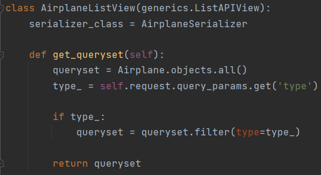
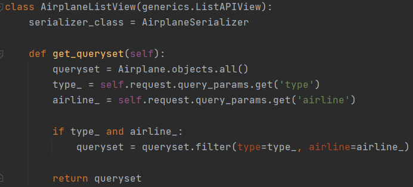
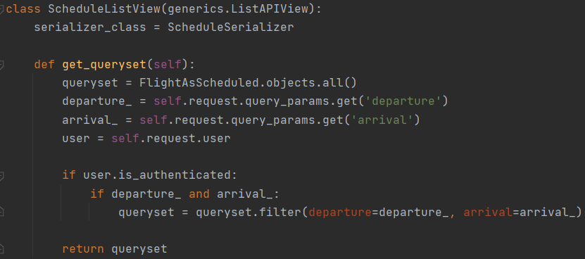

## 2.1.1 Ручные фильтры

### Задание:
Реализовать вручную следующие фильтры:

* принимает параметр из url-адреса и выводит отфильтрованные данные. (GET, ListAPIView)
* принимает 2 параметра из url-адреса и выводит отфильтрованные данные. (GET, ListAPIView)
* принимает 2 параметра из url-адреса и выводит отфильтрованные данные, если пользователь авторизован и неотфильтрованные, если не авторизован. (GET, ListAPIView)
    
Фильтр самолётов по типу:

Фильтр самолётов по типу и авиалинии:

Фильтр рейсов по городам вылета и прилёта для авторизованных пользователей:
