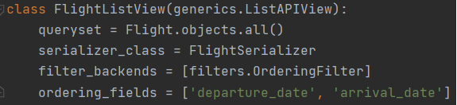
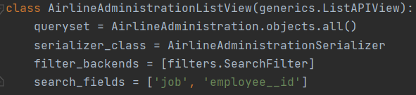
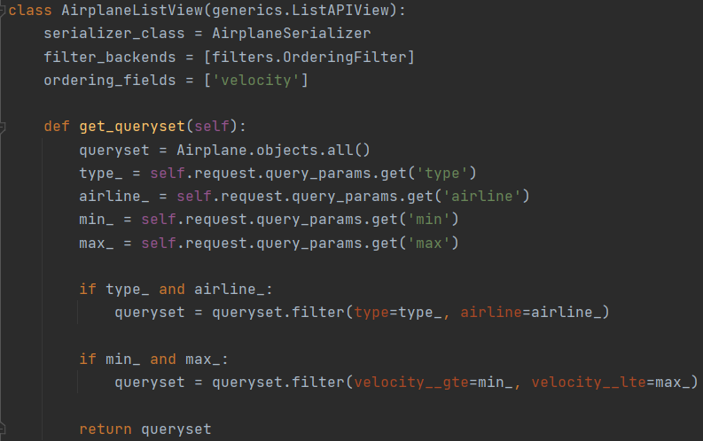

## 2.1.2 Автоматические фильтры

### Задание:
Реализовать следующие фильтры с помощью библиотеки django-filters:

* сортировка по дате, поиск, поиск по полям из связной таблицы
* сортировка в диапазоне цен, дат или каких-либо других числовых значений
    
Сортировка рейсов по датам вылета и прилёта: 

Поиск сотрудника по названию должности и ID из связной таблицы:

Сортировка самолётов в диапазоне скоростей:
