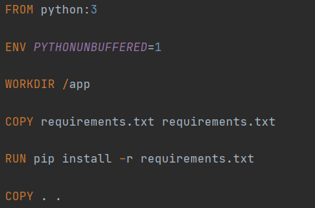

## 1. Контейниризация средствами Docker.

### Задание:
1. Написать Dockerfile для запуска бэкенд части проекта из курса "Web-программирование".
2. Выполнить следующие действия:
    * Изменить модель БД Django
    * Зайти в контейнер и выполнить миграции
    
Dockerfile:

Миграции в контейнере:
