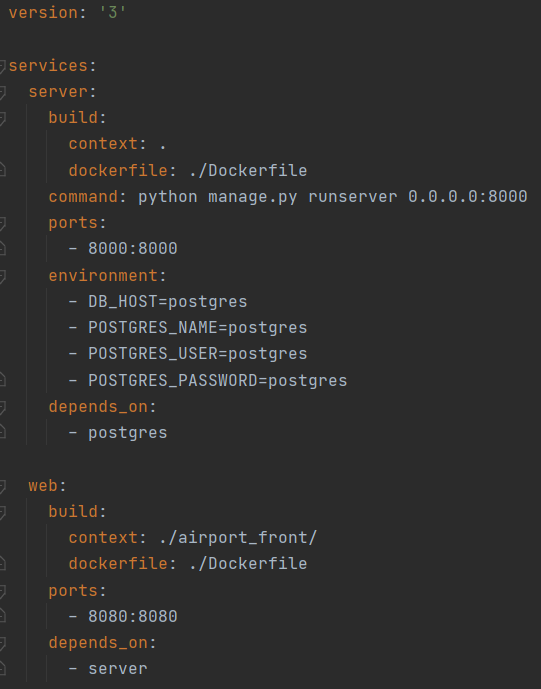
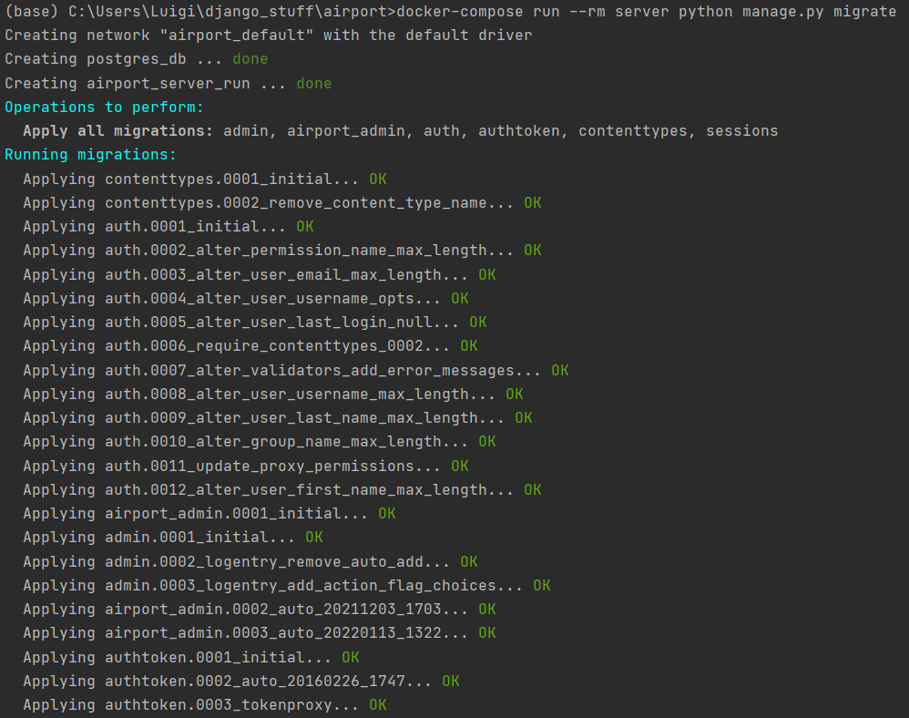
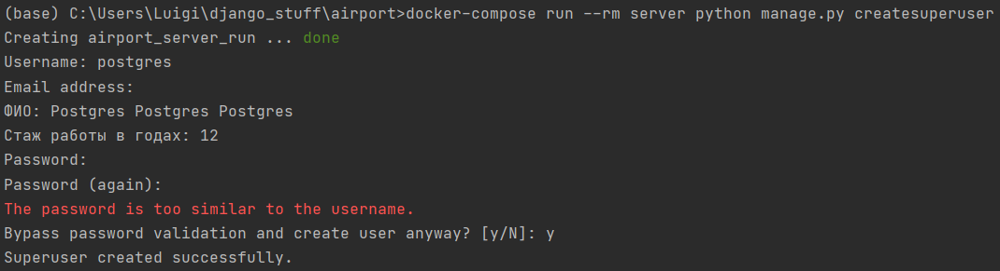
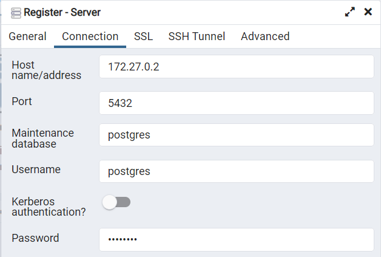
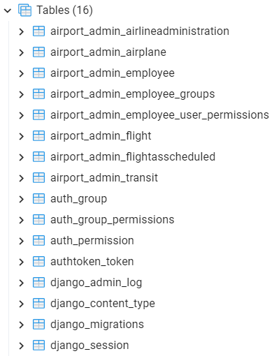

## 2. Оркестрация средствами Docker-compose.

### Задание:
1. Реализовать работу в оркестре всех сервисов из 3 и 4 работы из курса "Web-программирование".
2. Выполнить команды необходимые для того, чтобы добавить нового пользователя в БД Postgres. С попощью пользователя должна быть возможность подключиться к БД из приложения для работы с БД.

Docker-compose:

Миграция на БД Postgres:

Создание суперпользователя:

Подключение к БД с помощью pgAdmin4:

